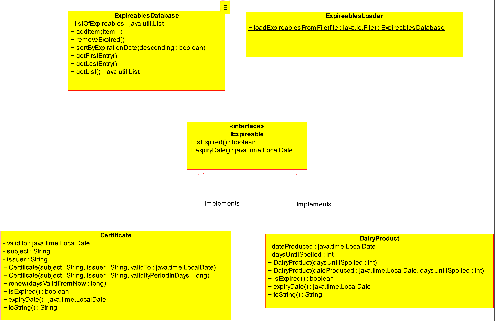

# SEA 8 Checkpoint 1

**Hints**

- You can use resources and search engines of your choice.
- Try to solve the problems from memorizing what you learned first.
- If you get stuck, skip to the next step!
- Regardless of whether you finish, remember to commit everything and push at the end.

## Downloading and initializing the project

### Work on your own fork

Fork this repo and clone your copy of the repo to your local machine. **You will work on your copy during the exercise and use the Github repo URL to submit your solutions.**

> Tip: commit and push your changes after each exercise, to avoid unpleasant surprises

### Gradle
We are using gradle and therefore you can use the gradle wrapper `.\gradlew.bat`.

To run the tests on your solution use `.\gradlew.bat test`.

# Exercises

##  Class diagram for Expireables

The following diagram shows the associations between the expireables `Certificate` and `DairyProduct` that implement the interface `IExpireable`:

- Instances of `Certificate` and `DairyProduct` can expire and can be validated through `IExpireable`'s `isExpired()` method.
- The `ExpireablesDatabase` is a generic class that can hold any type that implements the `IExpireable` interface.
  - It contains a list that you need to manage with your solution.
  - It can be sorted (use a Comparator with the expiration date).
  - All expired items can be automatically be removed.
- `ExpireablesLoader` lets you load entries from a csv file and returns an `ExpireablesDatabase` containing them.
  - Check out the comments in `ExpireablesLoader` and have a look at the csv used in testing at `src/test/resources/expireables.csv`

## Working on your solution

You will find comments along the lines of `// TODO: do something here` thoughout the code. This is what you need to work on.

I would recommend the following order, but feel free to adapt to your needs:
- Read through the files except `ExpireablesLoader`
- Also have a look at the corresponding unit tests
- Complete `Certificate` and `DairyProduct`
- Work on `ExpireablesDatabase`
- Finish with completing `ExpireablesLoader`

## Testing

When you change implementation parts, always make sure the tests still pass.

Execute tests with `.\gradlew.bat test`

## Quiz

You will find a `quiz.txt`  file at the root of your local repository.

Answer the questions at the answer ("A:") lines.

> Try to answer without any help from the Internet!

## Finalization

Commit the changes made to your local branch; and push everything to your forked Repo.

Post the URL of your Repo as a direct message to your trainer in Rocket Chat.
